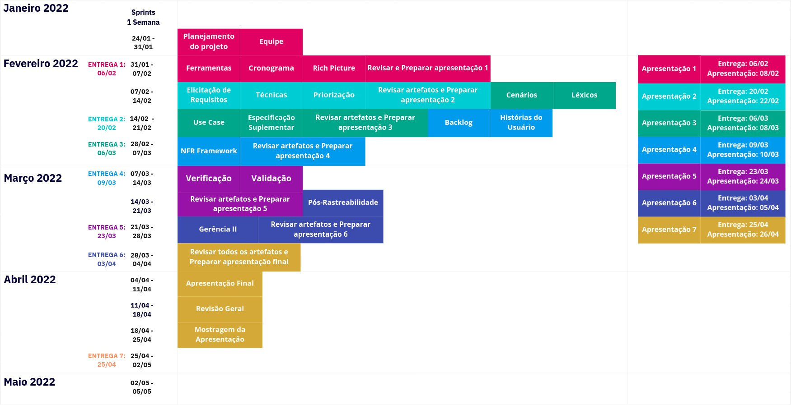
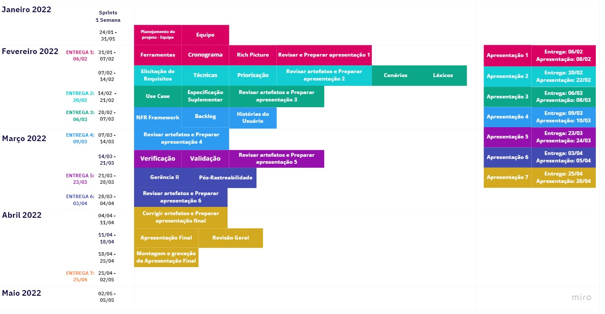

# Cronograma
## Versionamento

| Versão | Data | Modificação | Autor |
|-|-|:-:|:-:|
| 1.0 | 02/02/2022 | Criação do cronograma | Victor Eduardo, Lívia Rodrigues |

*Tabela 1: versionamento*

## Introdução

&emsp;&emsp; O cronograma visa organizar de maneira sistematica em sprints ao longo do periodo do projeto as atividades que serão realizadas, o mesmo está sujeito a alterações e acréscimos caso necessário. 

## Datas e Sprints

### V1 - Versão inicial do projeto

*Imagem 1: Cronograma das atividades Versão Inicial*

*Autor: Luiz Henrique, Victor Eduardo, João Victor, Livia Rodrigues, Gabriel Sabanai* 

*Imagem 2: Cronograma das atividades Versão Final*

*Autor: Luiz Henrique* 

## Referências

- 
 SALES, André. Plano de Ensino: Requisitos de Software 2021.2. Acesso em 03 de Março de 2022
