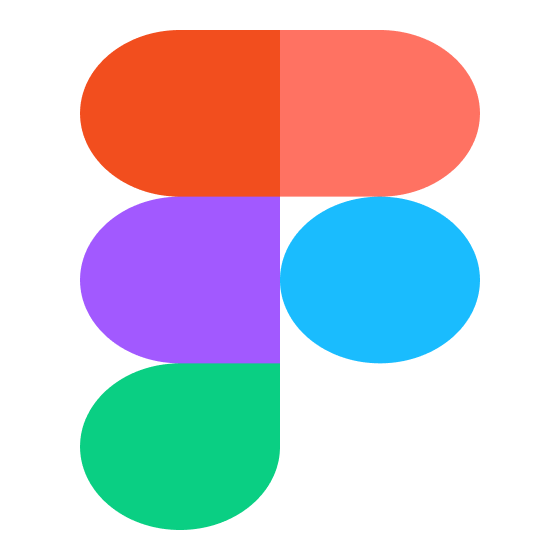
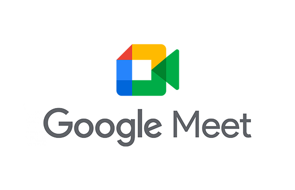
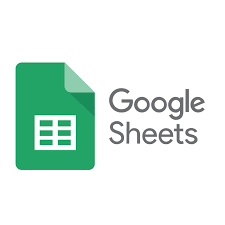
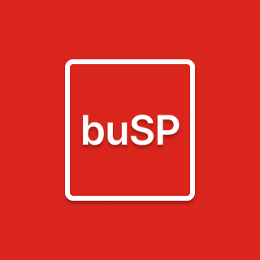

# Ferramentas
## Versionamento

| Versão | Data | Modificação | Autor |
|-|-|:-:|:-:|
| 1.0 | 24/05 | Adição das ferramentas do projeto | Lívia Rodrigues |

*Tabela 1: versionamento*

## Introdução

 As ferramentas serão softwares utilizados no projeto para facilitar o gerenciamento, comunicação e desenvolvimento da documentação necessária. Projeto esse que o foco será a construção dos requsitos do aplicativo buSP. 

*Tabela 2: introdução*

## Ferramentas utilizadas

||Ferramenta|Finalidade|
|:-:|:-:|-|
| {width="80"}| Figma | Prototipação. |
| {width="80"}| Github | Versionamento do projeto. |
| {width="80"}|  Telegram | Comunicação por texto entre os integrantes. |
| {width="80"} | Google Meets | Reuniões da equipe. |
| {width="80"}| Google Forms | Elicitar requisitos. |
| {width="80"}| Google Sheets | Analisar horários que o time estará disponível. |
| {width="80"}| Miro | Criação de diagramas e kanban da entrega dos artefatos. |
| {width="80"}| Visual Studio Code | Ferramenta usada para edição dos documentos. |
| {width="80"}| buSP App | Aplicação a ser desenvolvida. |

*Tabela 3: Tabela contendo as ferramentas utilizadas no projeto*

## Referências

Wiki Requisitos - Planejamento - Ferramentas. Disponível em: https://github.com/Requisitos-de-Software/2020.2-CarteiraDigitalTransito/blob/main/docs/planejamento.md. Acesso em: 06 de março de 2022.

*Tabela 4: Tabela de referências*
